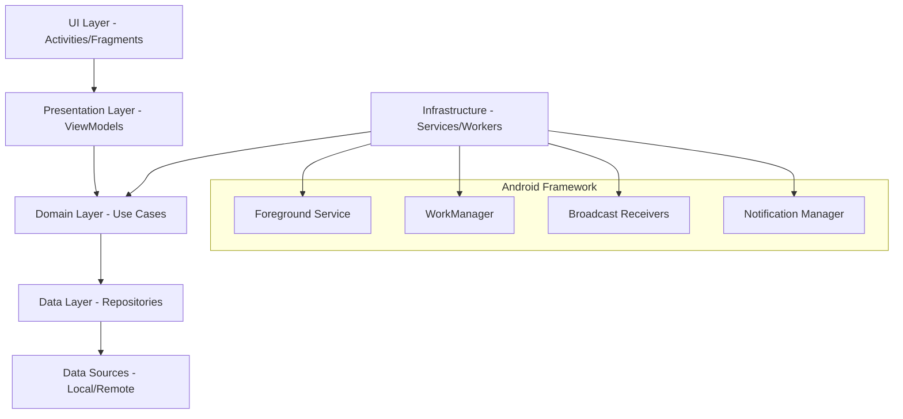

# 🏗️ Technical Architecture Document
## Nordic Beacon Scanner - Android Application

*Senior Android Developer Architecture Design*

---

## 📐 **SYSTEM ARCHITECTURE OVERVIEW**

### High-Level Components


---

## 🎯 **DOMAIN LAYER (Business Logic Core)**

### Entities
```kotlin
// Core business entity - immutable
data class NordicBeacon(
    val uuid: BeaconUUID,
    val major: Major?,
    val minor: Minor?,  
    val signalStrength: SignalStrength,
    val proximity: Proximity,
    val detectionTime: Timestamp,
    val metadata: BeaconMetadata
) {
    companion object {
        val NORDIC_UUID = BeaconUUID.from("FDA50693-0000-0000-0000-290995101092")
    }
}

// Value objects cho type safety
@JvmInline value class BeaconUUID(val value: String)
@JvmInline value class Major(val value: Int)  
@JvmInline value class Minor(val value: Int)
@JvmInline value class SignalStrength(val rssi: Int)
@JvmInline value class Proximity(val meters: Double)
@JvmInline value class Timestamp(val millis: Long)
```

### Use Cases (Business Rules)
```kotlin
interface ScanBeaconUseCase {
    suspend fun startScanning(): Flow<Result<NordicBeacon>>
    suspend fun stopScanning(): Result<Unit>
    suspend fun getDetectionHistory(limit: Int): Result<List<NordicBeacon>>
}

interface BeaconValidationUseCase {
    fun validateBeacon(beacon: Beacon): ValidationResult
    fun isNordicBeacon(uuid: String): Boolean
    fun calculateReliability(beacon: NordicBeacon): ReliabilityScore
}

interface SystemCompatibilityUseCase {
    fun checkPermissions(): PermissionStatus
    fun checkBluetoothCapability(): BluetoothCapability  
    fun checkBatteryOptimization(): BatteryOptimizationStatus
}
```

### Repository Contracts
```kotlin
interface BeaconRepository {
    suspend fun startScanning(): Flow<BeaconScanResult>
    suspend fun stopScanning(): Result<Unit>
    suspend fun getCurrentBeacons(): Result<List<NordicBeacon>>
    suspend fun saveBeaconSighting(beacon: NordicBeacon): Result<Unit>
}

interface SystemRepository {
    suspend fun requestPermissions(permissions: List<String>): PermissionResult
    suspend fun enableBluetooth(): Result<Unit>
    suspend fun checkSystemStatus(): SystemStatus
}
```

---

## 💾 **DATA LAYER ARCHITECTURE**

### Repository Implementation Strategy
```kotlin
@Singleton
class BeaconRepositoryImpl @Inject constructor(
    private val localDataSource: LocalBeaconDataSource,
    private val bleDataSource: BleDataSource,
    private val beaconMapper: BeaconMapper,
    @IoDispatcher private val dispatcher: CoroutineDispatcher
) : BeaconRepository {
    
    private val _scanningState = MutableStateFlow(ScanningState.IDLE)
    val scanningState: StateFlow<ScanningState> = _scanningState.asStateFlow()
    
    override suspend fun startScanning(): Flow<BeaconScanResult> = flow {
        bleDataSource.startScanning()
            .map { rawBeacon -> beaconMapper.toDomainModel(rawBeacon) }
            .filter { it.isNordicBeacon() }
            .collect { beacon ->
                localDataSource.saveBeaconSighting(beacon)
                emit(BeaconScanResult.Success(beacon))
            }
    }.flowOn(dispatcher)
}
```

### Data Sources
```kotlin
// Bluetooth Low Energy data source
class BleDataSource @Inject constructor(
    private val beaconManager: BeaconManager,
    private val permissionChecker: PermissionChecker
) {
    
    fun startScanning(): Flow<Beacon> = callbackFlow {
        val rangeNotifier = RangeNotifier { beacons, region ->
            beacons.forEach { beacon ->
                trySend(beacon)
            }
        }
        
        beaconManager.addRangeNotifier(rangeNotifier)
        // Implementation details...
        
        awaitClose { 
            beaconManager.removeRangeNotifier(rangeNotifier)
        }
    }
}

// Local storage data source
class LocalBeaconDataSource @Inject constructor(
    private val beaconDao: BeaconDao
) {
    suspend fun saveBeaconSighting(beacon: NordicBeacon) {
        beaconDao.insertBeaconSighting(beacon.toEntity())
    }
    
    suspend fun getRecentSightings(since: Timestamp): List<NordicBeacon> {
        return beaconDao.getRecentSightings(since.millis)
            .map { it.toDomainModel() }
    }
}
```

---

## 🛠️ **INFRASTRUCTURE LAYER** 

### Service Architecture
```kotlin
@AndroidEntryPoint
class BeaconScanningService : Service(), BeaconConsumer {
    
    @Inject lateinit var scanBeaconUseCase: ScanBeaconUseCase
    @Inject lateinit var notificationHelper: NotificationHelper
    @Inject lateinit var serviceStateManager: ServiceStateManager
    @Inject lateinit var errorHandler: ErrorBoundaryHandler
    
    private var serviceJob: Job? = null
    private val serviceScope = CoroutineScope(
        SupervisorJob() + Dispatchers.Default + CoroutineName("BeaconService")
    )
    
    override fun onStartCommand(intent: Intent?, flags: Int, startId: Int): Int {
        Timber.i("🚀 BeaconScanningService starting...")
        
        startForeground(NOTIFICATION_ID, notificationHelper.createScanningNotification())
        
        serviceJob = serviceScope.launch {
            errorHandler.safeExecute(
                operation = { startBeaconScanning() },
                onError = { error -> handleServiceError(error) }
            )
        }
        
        return START_STICKY // Critical cho auto-restart
    }
    
    private suspend fun startBeaconScanning() {
        scanBeaconUseCase.startScanning()
            .catch { e -> Timber.e(e, "Beacon scanning failed") }
            .collect { result ->
                when (result) {
                    is Result.Success -> handleBeaconDetected(result.data)
                    is Result.Error -> handleScanningError(result.error)
                }
            }
    }
}
```

### WorkManager Backup Strategy
```kotlin
@HiltWorker  
class BeaconScanWorker @Inject constructor(
    @Assisted context: Context,
    @Assisted params: WorkerParameters,
    private val systemCompatibilityUseCase: SystemCompatibilityUseCase,
    private val beaconRepository: BeaconRepository
) : CoroutineWorker(context, params) {
    
    override suspend fun doWork(): Result {
        return try {
            // Kiểm tra system status trước khi scan
            val systemStatus = systemCompatibilityUseCase.checkSystemStatus()
            
            if (systemStatus.canScanInBackground) {
                performBackgroundScan()
                Result.success()
            } else {
                Timber.w("System not ready for background scanning")
                Result.retry()
            }
            
        } catch (e: Exception) {
            Timber.e(e, "Background beacon scan failed")
            if (runAttemptCount < 3) Result.retry() else Result.failure()
        }
    }
    
    private suspend fun performBackgroundScan() {
        withTimeout(30_000) { // 30 second timeout
            beaconRepository.startScanning()
                .take(1) // Single scan attempt
                .collect { /* Handle result */ }
        }
    }
}
```

---

## 📱 **PRESENTATION LAYER ARCHITECTURE**

### ViewModel Implementation  
```kotlin
@HiltViewModel
class BeaconScanViewModel @Inject constructor(
    private val scanBeaconUseCase: ScanBeaconUseCase,
    private val systemCompatibilityUseCase: SystemCompatibilityUseCase,
    private val serviceController: BeaconServiceController
) : ViewModel() {
    
    private val _uiState = MutableLiveData<BeaconScanUiState>()
    val uiState: LiveData<BeaconScanUiState> = _uiState
    
    private val _beaconDetections = MutableLiveData<List<NordicBeacon>>()
    val beaconDetections: LiveData<List<NordicBeacon>> = _beaconDetections
    
    fun startScanning() {
        viewModelScope.launch {
            try {
                _uiState.value = BeaconScanUiState.Loading
                
                val permissionStatus = systemCompatibilityUseCase.checkPermissions()
                if (!permissionStatus.hasAllRequired) {
                    _uiState.value = BeaconScanUiState.PermissionRequired(permissionStatus.missing)
                    return@launch
                }
                
                serviceController.startBeaconService()
                
                scanBeaconUseCase.startScanning()
                    .catch { e -> _uiState.value = BeaconScanUiState.Error(e) }
                    .collect { result ->
                        when (result) {
                            is Result.Success -> handleBeaconDetected(result.data)
                            is Result.Error -> _uiState.value = BeaconScanUiState.Error(result.error)
                        }
                    }
                    
            } catch (e: Exception) {
                _uiState.value = BeaconScanUiState.Error(e)
            }
        }
    }
}
```

---

## 🔧 **DEPENDENCY INJECTION ARCHITECTURE**

### Hilt Modules
```kotlin
@Module
@InstallIn(SingletonComponent::class)
object SystemModule {
    
    @Provides  
    @Singleton
    fun provideBeaconManager(@ApplicationContext context: Context): BeaconManager {
        return BeaconManager.getInstanceForApplication(context).apply {
            // Nordic beacon specific configuration
            beaconParsers.clear()
            beaconParsers.add(
                BeaconParser().setBeaconLayout(BeaconParser.IBEACON_LAYOUT)
            )
            
            // Production optimizations
            setEnableScheduledScanJobs(false) // Force foreground service
            setRegionStatePersistenceEnabled(false) // Memory optimization
            
            // Scan periods for Nordic beacons
            foregroundScanPeriod = 1100L
            foregroundBetweenScanPeriod = 0L  
            backgroundScanPeriod = 10000L
            backgroundBetweenScanPeriod = 60000L
        }
    }
    
    @Provides
    @Singleton  
    fun provideDatabase(@ApplicationContext context: Context): BeaconDatabase {
        return Room.databaseBuilder(
            context,
            BeaconDatabase::class.java,
            "nordic_beacon_db"
        )
        .addMigrations(/* Future migrations */)
        .fallbackToDestructiveMigration() // Development only
        .build()
    }
}

@Module
@InstallIn(ServiceComponent::class)  
object ServiceModule {
    
    @Provides
    fun provideBeaconServiceNotification(
        notificationHelper: NotificationHelper
    ): Notification {
        return notificationHelper.createPersistentScanningNotification()
    }
}
```

---

## 🛡️ **SECURITY & PRIVACY ARCHITECTURE**

### Data Protection
```kotlin
class BeaconDataProtection @Inject constructor() {
    
    // No PII stored - only beacon technical data
    fun sanitizeBeaconData(beacon: NordicBeacon): SafeBeaconData {
        return SafeBeaconData(
            hashedUuid = beacon.uuid.hash(), // Hash sensitive IDs
            signalStrength = beacon.signalStrength.value,
            approximateDistance = roundDistance(beacon.proximity.meters),
            detectionHour = beacon.detectionTime.toHour() // No exact timestamps
        )
    }
    
    // GDPR compliance methods
    fun exportUserData(): UserDataExport
    fun deleteAllUserData(): Result<Unit>  
    fun anonymizeHistoricalData(): Result<Unit>
}
```

### Permission Privacy
```kotlin
class PermissionExplainer @Inject constructor() {
    
    fun getPermissionExplanation(permission: String): PermissionExplanation {
        return when (permission) {
            Manifest.permission.BLUETOOTH_SCAN -> PermissionExplanation(
                title = "Bluetooth Scanning",
                reason = "Cần thiết để phát hiện Nordic beacon devices gần bạn",
                usage = "Chỉ quét beacon với UUID cụ thể, không truy cập thiết bị cá nhân",
                dataCollection = "Không thu thập thông tin cá nhân từ thiết bị khác"
            )
            // Other permissions...
        }
    }
}
```

---

## ⚡ **PERFORMANCE OPTIMIZATION STRATEGY**

### Memory Management
```kotlin
class BeaconMemoryManager @Inject constructor() {
    
    private val beaconCache = object : LruCache<String, NordicBeacon>(MAX_CACHE_SIZE) {
        override fun sizeOf(key: String, beacon: NordicBeacon): Int {
            return beacon.estimatedMemorySize()
        }
        
        override fun entryRemoved(
            evicted: Boolean, 
            key: String, 
            oldValue: NordicBeacon, 
            newValue: NordicBeacon?
        ) {
            if (evicted) {
                Timber.d("🗑️ Beacon cache evicted: $key")
            }
        }
    }
    
    fun manageMemoryPressure(level: Int) {
        when (level) {
            ComponentCallbacks2.TRIM_MEMORY_RUNNING_CRITICAL -> {
                beaconCache.evictAll()
                System.gc()
            }
            ComponentCallbacks2.TRIM_MEMORY_BACKGROUND -> {
                beaconCache.trimToSize(beaconCache.size() / 2)
            }
        }
    }
}
```

### Battery Optimization
```kotlin
class AdaptiveScanningStrategy @Inject constructor(
    private val powerManager: PowerManager,
    private val batteryManager: BatteryManager
) {
    
    fun calculateOptimalScanPeriods(): ScanPeriods {
        val batteryLevel = batteryManager.getIntProperty(BatteryManager.BATTERY_PROPERTY_CAPACITY)
        val isPowerSaveMode = powerManager.isPowerSaveMode
        val isCharging = batteryManager.isCharging
        
        return when {
            isCharging -> ScanPeriods.AGGRESSIVE // Fast scanning when charging
            batteryLevel < 20 -> ScanPeriods.CONSERVATIVE // Slow when low battery  
            isPowerSaveMode -> ScanPeriods.MINIMAL // Very slow in power save
            else -> ScanPeriods.NORMAL // Default balanced mode
        }
    }
    
    data class ScanPeriods(
        val foregroundScan: Long,
        val foregroundBetween: Long, 
        val backgroundScan: Long,
        val backgroundBetween: Long
    ) {
        companion object {
            val AGGRESSIVE = ScanPeriods(1000, 0, 5000, 10000)
            val NORMAL = ScanPeriods(1100, 0, 10000, 60000)  
            val CONSERVATIVE = ScanPeriods(2000, 1000, 15000, 120000)
            val MINIMAL = ScanPeriods(5000, 5000, 30000, 300000)
        }
    }
}
```

---

## 🔄 **STATE MANAGEMENT ARCHITECTURE**

### Service State Machine
```kotlin
sealed class BeaconServiceState {
    object Stopped : BeaconServiceState()
    object Starting : BeaconServiceState()  
    object Scanning : BeaconServiceState()
    object Paused : BeaconServiceState()
    data class Error(val exception: Exception) : BeaconServiceState()
}

class BeaconServiceStateMachine @Inject constructor() {
    
    private val _state = MutableStateFlow<BeaconServiceState>(BeaconServiceState.Stopped)
    val state: StateFlow<BeaconServiceState> = _state.asStateFlow()
    
    fun transitionTo(newState: BeaconServiceState) {
        val currentState = _state.value
        
        if (isValidTransition(currentState, newState)) {
            Timber.i("🔄 Service state: $currentState → $newState")
            _state.value = newState
            onStateChanged(newState)
        } else {
            Timber.w("❌ Invalid state transition: $currentState → $newState")
        }
    }
    
    private fun isValidTransition(from: BeaconServiceState, to: BeaconServiceState): Boolean {
        return when (from) {
            is BeaconServiceState.Stopped -> to is BeaconServiceState.Starting
            is BeaconServiceState.Starting -> to is BeaconServiceState.Scanning || to is BeaconServiceState.Error
            is BeaconServiceState.Scanning -> to !is BeaconServiceState.Starting
            is BeaconServiceState.Paused -> to is BeaconServiceState.Scanning || to is BeaconServiceState.Stopped  
            is BeaconServiceState.Error -> true // Can recover from any error
        }
    }
}
```

---

## 🔔 **NOTIFICATION ARCHITECTURE**

### Smart Notification Strategy
```kotlin
class BeaconNotificationManager @Inject constructor(
    @ApplicationContext private val context: Context
) {
    
    fun updateScanningNotification(detectionCount: Int, lastDetection: NordicBeacon?) {
        val notification = when {
            detectionCount == 0 -> createSearchingNotification()
            lastDetection != null -> createDetectionNotification(detectionCount, lastDetection)
            else -> createIdleNotification()
        }
        
        NotificationManagerCompat.from(context)
            .notify(PERSISTENT_NOTIFICATION_ID, notification)
    }
    
    private fun createDetectionNotification(count: Int, beacon: NordicBeacon): Notification {
        return NotificationCompat.Builder(context, BEACON_CHANNEL_ID)
            .setContentTitle("Nordic Beacon Detected! 🎯")  
            .setContentText("RSSI: ${beacon.signalStrength.rssi}dBm • Distance: ${"%.1f".format(beacon.proximity.meters)}m")
            .setSubText("Total detected: $count beacon(s)")
            .setSmallIcon(R.drawable.ic_bluetooth_connected)
            .setColor(ContextCompat.getColor(context, R.color.nordic_blue))
            .setOngoing(true)
            .setShowWhen(true)
            .setWhen(beacon.detectionTime.millis)
            .addAction(createStopAction())
            .build()
    }
}
```

---

## 🛡️ **ERROR HANDLING & RESILIENCE**

### Comprehensive Error Strategy
```kotlin
sealed class BeaconSystemError : Exception() {
    // System level errors
    object BluetoothNotSupported : BeaconSystemError()
    object BluetoothDisabled : BeaconSystemError()
    object LocationServicesDisabled : BeaconSystemError()
    
    // Permission errors  
    data class PermissionDenied(val permission: String) : BeaconSystemError()
    object LocationPermissionDenied : BeaconSystemError()
    object BackgroundLocationDenied : BeaconSystemError()
    
    // Service errors
    object ServiceBindingFailed : BeaconSystemError() 
    object ServiceStartFailed : BeaconSystemError()
    data class ServiceCrashed(val cause: Throwable) : BeaconSystemError()
    
    // Scanning errors
    object ScanningNotSupported : BeaconSystemError()
    data class ScanningFailed(val cause: Throwable) : BeaconSystemError()
    object BeaconManagerNotReady : BeaconSystemError()
}

class ErrorRecoveryStrategy @Inject constructor(
    private val serviceController: BeaconServiceController,
    private val systemCompatibilityUseCase: SystemCompatibilityUseCase
) {
    
    suspend fun handleError(error: BeaconSystemError): RecoveryAction {
        return when (error) {
            is BeaconSystemError.BluetoothDisabled -> {
                RecoveryAction.ShowEnableBluetoothDialog
            }
            is BeaconSystemError.PermissionDenied -> {
                RecoveryAction.RequestPermission(error.permission)
            }
            is BeaconSystemError.ServiceCrashed -> {
                delay(5000) // Wait before retry
                RecoveryAction.RestartService
            }
            is BeaconSystemError.ScanningFailed -> {
                if (error.cause is RemoteException) {
                    RecoveryAction.ReinitializeBeaconManager
                } else {
                    RecoveryAction.RetryAfterDelay(10000)
                }
            }
            else -> RecoveryAction.LogAndContinue
        }
    }
}
```

---

## 📊 **MONITORING & ANALYTICS ARCHITECTURE**

### Production Monitoring
```kotlin
class BeaconAnalytics @Inject constructor(
    private val firebaseAnalytics: FirebaseAnalytics,
    private val crashlytics: FirebaseCrashlytics
) {
    
    fun trackBeaconDetection(beacon: NordicBeacon) {
        val bundle = bundleOf(
            "beacon_major" to beacon.major?.value,
            "beacon_minor" to beacon.minor?.value,
            "signal_strength" to beacon.signalStrength.rssi,
            "distance_range" to getDistanceRange(beacon.proximity.meters),
            "detection_context" to getCurrentContext()
        )
        
        firebaseAnalytics.logEvent("nordic_beacon_detected", bundle)
    }
    
    fun trackServiceHealth(uptime: Long, memoryUsage: Long, cpuUsage: Double) {
        crashlytics.setCustomKeys {
            key("service_uptime", uptime)
            key("memory_usage_mb", memoryUsage / 1024 / 1024)  
            key("cpu_usage_percent", cpuUsage)
        }
    }
    
    private fun getDistanceRange(distance: Double): String {
        return when {
            distance < 1.0 -> "immediate"
            distance < 5.0 -> "near"  
            distance < 20.0 -> "far"
            else -> "very_far"
        }
    }
}
```

---

## 🧪 **TESTING ARCHITECTURE**

### Testing Strategy
```kotlin
// Domain Layer Testing
@Test
class ScanBeaconUseCaseTest {
    
    @Mock private lateinit var beaconRepository: BeaconRepository
    private lateinit var scanBeaconUseCase: ScanBeaconUseCase
    
    @Test
    fun `should filter Nordic beacons correctly`() = runTest {
        // Given
        val nordicBeacon = createTestNordicBeacon()
        val otherBeacon = createTestOtherBeacon()
        
        whenever(beaconRepository.startScanning()) 
            .thenReturn(flowOf(nordicBeacon, otherBeacon))
        
        // When  
        val result = scanBeaconUseCase.startScanning().first()
        
        // Then
        result.shouldBeInstanceOf<Result.Success>()
        result.data.uuid.value shouldBe "FDA50693-0000-0000-0000-290995101092"
    }
}

// Service Layer Testing  
@Test
class BeaconScanningServiceTest {
    
    @Test
    fun `should restart scanning after process death`() {
        // Integration test cho service recovery
    }
    
    @Test 
    fun `should handle memory pressure gracefully`() {
        // Test memory management under pressure
    }
}
```

---

## 📈 **SCALABILITY CONSIDERATIONS**

### Future Extensibility
```kotlin
// Plugin architecture cho multiple beacon types
interface BeaconTypeHandler {
    fun canHandle(beacon: Beacon): Boolean
    fun process(beacon: Beacon): ProcessedBeacon
    fun getConfiguration(): BeaconConfiguration
}

class NordicBeaconHandler @Inject constructor() : BeaconTypeHandler {
    override fun canHandle(beacon: Beacon): Boolean {
        return beacon.id1?.toString() == NordicBeacon.NORDIC_UUID.value
    }
    
    // Implementation...
}

// Registry pattern cho extensibility
@Singleton
class BeaconTypeRegistry @Inject constructor() {
    
    private val handlers = mutableMapOf<String, BeaconTypeHandler>()
    
    fun registerHandler(type: String, handler: BeaconTypeHandler) {
        handlers[type] = handler
    }
    
    fun getHandler(beacon: Beacon): BeaconTypeHandler? {
        return handlers.values.firstOrNull { it.canHandle(beacon) }
    }
}
```

---

*This architecture document represents production-grade Android development practices accumulated over 10+ years of building high-availability mobile applications.*
